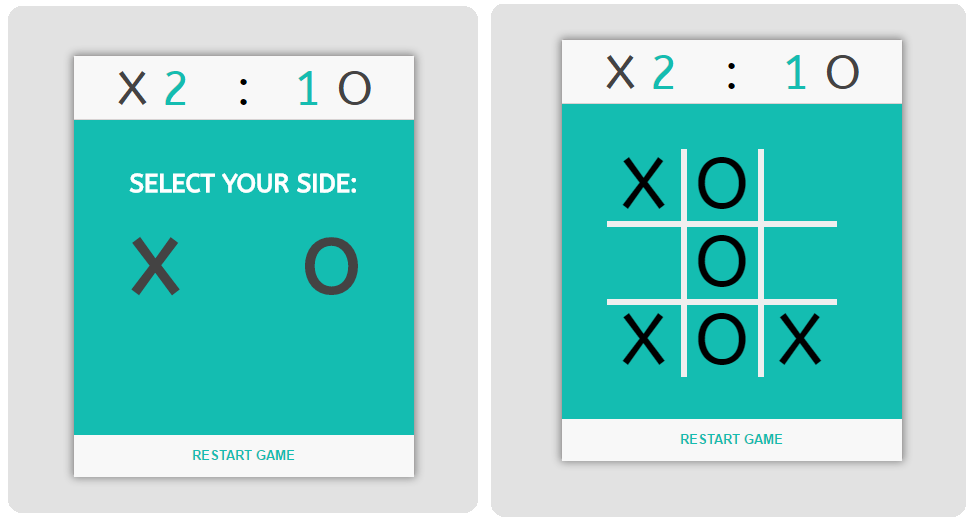

# TicTacToe

This project is one of the final projects required to receive the FreeCodeCamp Front End Development Certificate

1. Objective: Build a CodePen.io app that is functionally similar to this: https://codepen.io/FreeCodeCamp/full/KzXQgy/
2. Fulfill the below user stories. Use whichever libraries or APIs you need. Give it your own personal style
3. User Story: I can play a game of Tic Tac Toe with the computer
4. User Story: My game will reset as soon as it's over so I can play again
5. User Story: I can choose whether I want to play as :x: or :o:

## Solution Proposed

The solution is composed mainly by 3 files: page.html, scripts.js, styles.css. The extra css file called animate.css is just adding a few extra animations to the game. 
The main function in the game is the `makeMovement(element)` function, which works in the following steps:
1. Checks if the game is over -> if it's not, the user can play
2. Checks if the player selected a valid position (you cannot play in the same position twice)
3. After the user make his movement, checks if there is a winner
4. If there's none, makes the computer play

```javascript
/**
* Function called when the user makes his movement
* param {element} element/position clicked
*/
function makeMovement(element){
	if(!gameIsOver){
		if($(element).text() == ''){
			$(element).text(side);
		}
		gameIsOver = checkWinner();
		if(!gameIsOver) { //if there is no winner, computer plays
			setTimeout(function(){ computerMovement(); }, 300);
		}
	}
}
```
There is a basic AI implemented to make the game a bit more fun. You can check the implementation under `computerMovement()` function. If you wish, you can improve this implementation to make the game harder.

```javascript
/**
* Computer play
* Here there is a very basic AI implementation
*/
function computerMovement(){
	if(	($('#11').text() == side ||
		$('#21').text() == side ||
		$('#23').text() == side ||
		$('#31').text() == side ||
		$('#33').text() == side)  &&
		$('#22').text() == '') {
		$('#22').text(computerSide);
	}
	else if(($('#11').text() == side || $('#13').text() == side) && $('#12').text() == ''){
		$('#12').text(computerSide);
	}
	else if(($('#31').text() == side || $('#33').text() == side) && $('#32').text() == ''){
		$('#32').text(computerSide);
	}
	else if(($('#31').text() == side || $('#32').text() == side) && $('#33').text() == ''){
		$('#33').text(computerSide);
	}
	else if(($('#21').text() == side || $('#22').text() == side) && $('#23').text() == ''){
		$('#23').text(computerSide);
	}
	else if(($('#12').text() == side|| $('#13').text() == side) && $('#11').text() == ''){
		$('#11').text(computerSide);
	}
	else {
		randomPlay();
	}
	setTimeout(function(){ gameIsOver = checkWinner(); }, 300);
}
```
And... this is how the game looks like:



